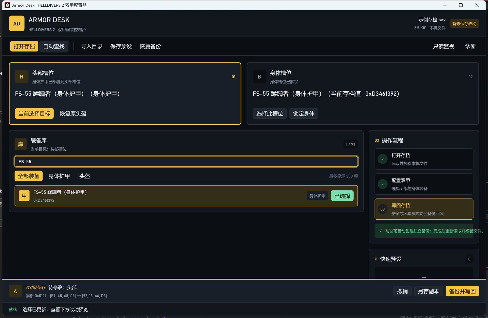

# HD2 双甲配置器

HD2 双甲配置器（Armor Desk）是一款 Windows 本地存档工具，用于把身体护甲配置到
HELLDIVERS 2 的头部或身体槽位。界面全中文；玩家按名称选择装备，不需要理解偏移、
校验和或十六进制数据。

- 支持头部与身体两个护甲槽位。
- 身体槽位默认可编辑，也可以手动锁定。
- 写回前显示改动预览。
- 写回前自动备份，写回后重新读取并校验。
- 不联网，不上传存档或账号数据。



*示例界面：FS-55 蹂躏者身体护甲已同时选入头部与身体槽位，尚未执行写回。*

## 使用前必须了解：法律与数据风险

本项目是非官方同人工具，与 Arrowhead Game Studios、Sony Interactive Entertainment、
Valve 或 HELLDIVERS 2 的其他权利方没有隶属、授权或背书关系。

修改游戏存档可能违反游戏最终用户许可协议、服务条款、平台规则或你所在地区的法律，
并可能导致存档损坏、云存档冲突、游戏异常、功能失效、账号限制或封禁。你有责任在使用前
自行确认适用规则并保留可靠备份。

**使用本工具产生的法律风险、账号风险、数据损失及其他后果均由用户自行承担。**
本项目作者和贡献者不保证工具适合任何特定用途，也不对直接或间接损失负责。本段不是法律意见。

## 获取程序

从本仓库的 [GitHub Releases](https://github.com/lona-cn/hd2-sav-editor/releases) 下载 Windows x64
发布包；优先选择最新稳定版本，并核对发布条目提供的校验值。不要使用来源不明的二次打包。
如果 Releases 暂无可下载文件，请按文末步骤自行从源码构建。

推送或合并到 `main` / `master` 后，GitHub Actions 会在 Windows 环境运行测试并构建发布版；
全部成功后自动创建并标记最新 Release。版本号直接使用 UTC+8 构建时间，不采用 SemVer，
格式为 `yyyyMMdd-HHmmssfff-UTC8`（例如 `20260920-093015123-UTC8`）。每个 Release 提供
Windows x64 ZIP 发布包及对应的 SHA-256 校验文件。

## 系统要求

- Windows 10 或 Windows 11，x64。
- 不需要安装 Python、Rust 或 WebView2。
- 建议把发布包完整解压到一个可写目录后再运行，不要直接在压缩包内启动。

## 第一次使用前

1. 完全退出游戏，等待 Steam 云同步结束。
2. 手动复制一份当前存档到安全位置。
3. 不要拿仓库中的 `.bin` 测试样本替换游戏存档；它们是合成测试数据。
4. 第一次写回后先检查备份，再启动游戏验证。

## 60 秒快速使用

### 1. 启动程序

双击 `hd2-armor-desk.exe`。

如果 Windows 显示安全警告，请先确认文件来源和校验值。不要为了运行本工具而关闭系统安全软件。

### 2. 打开存档

点击顶部的“打开存档”：

- 知道存档位置：直接选择存档文件。
- 不知道位置：点击“自动查找”，从程序发现的 Steam 存档中选择。程序会读取 Windows
  注册表中的 Steam 安装目录，所以 Steam 安装在其他盘符或自定义目录时也能发现。

成功打开后，顶部会显示文件名，头部和身体卡片会显示当前装备。

### 3. 选择要修改的槽位

点击“头部槽位”或“身体槽位”卡片：

- 头部槽位可以选择身体护甲或普通头盔。
- 身体槽位默认解锁，可以直接选择身体护甲。
- 如果暂时不想修改身体槽位，可以点击“锁定身体”。锁定会放弃尚未写入的身体改动。

黄色边框表示当前选择目标。

### 4. 选择装备

在装备库中搜索名称或十六进制 ID。已识别身体护甲的条目会直接显示被动名称和中文效果说明，
确认作用后再点击装备行右侧的“选择”。

选择后请检查：

- 槽位卡片是否显示了正确装备。
- 装备行是否显示“已选择”。
- 底部差异栏是否只列出了你准备修改的槽位。

### 5. 保存

底部提供两种入口：

- **另存副本**：生成新文件，不修改当前存档。适合第一次试用或离线检查。
- **备份并写回**：打开写回模式确认框，写入当前存档。

写回确认框有两种模式：

#### 安全写回

推荐首次使用。只有磁盘文件仍与打开时一致才会写入；如果游戏或其他程序已经改过文件，
本次操作会被拒绝。

#### 风险写入最新文件

适合游戏刚切换过身体护甲、但你仍希望立即应用本工具选择的情况。程序会重新读取当前磁盘文件，
在最新内容上应用你明确选择的头部和身体护甲，并尽量保留其他最新数据。

风险模式不是“绝对安全模式”：如果游戏持续写盘，它仍可能拒绝操作；即使写入成功，游戏之后也可能
再次覆盖结果。遇到这种情况请等待文件稳定后重试。

两种模式都会：

1. 创建独立备份并回读备份。
2. 只修改允许的护甲槽位及必要校验值。
3. 写入后重新读取文件，确认结果与目标一致。

## 经典双甲组合（实验性）

下面是按游戏原生[护甲被动](https://helldivers.wiki.gg/wiki/Armor_Passives)整理的常见搭配思路。
它们不是本项目对“双被动必定生效”的承诺：目前只确认已验证的 FS-55 身体护甲 ID 可以写入头部槽位；第二份被动、
相同被动叠加倍率以及不同游戏版本的表现都需要玩家自行进游戏验证。

| 玩法 | 头部槽位选择身体护甲 | 身体槽位 | 搭配思路 |
| --- | --- | --- | --- |
| 生存容错 | DP-40 联邦英雄 | CM-09 碎骨杀手 | `Democracy Protects` 配合 `Med-Kit`；尝试兼顾致命伤容错和针剂续航。 |
| 爆破压枪 | CE-74 破裂者 | FS-55 蹂躏者（身体护甲） | `Engineering Kit` 配合 `Fortified`；尝试兼顾投掷物、蹲姿压枪和爆炸抗性。 |
| 潜行跑图 | SC-30 开路侦察兵 | B-08 轻装枪手 | `Scout` 配合 `Extra Padding`；尝试在侦察能力之外补充护甲评级。 |
| 火场重装 | I-44 火蜥 | FS-55 蹂躏者（身体护甲） | `Inflammable` 配合 `Fortified`；面向火焰和爆炸威胁较多的任务。 |
| 同款双甲 | FS-55 蹂躏者（身体护甲） | FS-55 蹂躏者（身体护甲） | 截图所示组合，适合先验证流程；同一被动是否重复叠加未知。 |

建议先使用“另存副本”，每次只测试一个组合。进入游戏后分别确认外观、护甲数值和被动效果；
如果结果不符预期，退出游戏并使用“恢复原头盔”或可靠备份。

## 备份与恢复

备份保存在程序旁边的工作区中。

- “恢复原头盔”只恢复头部槽位，不替换整份存档。
- “恢复备份”会用所选备份替换整份存档；执行前还会保存一份当前文件的安全副本。

恢复整份备份会覆盖武器、角色状态和其他存档内容。确认文件日期与名称后再操作。

## 装备库与目录导入

程序自带装备目录，通常可以直接搜索使用。如果缺少某件装备，可以通过“导入目录”导入：

- 旧工具导出的 `catalog.json`；
- CSV 目录；
- 本工具的 v2 JSON 目录。

装备库显示名称、ID 和装备类型；67 件已识别身体护甲还会显示被动名称与效果，不显示内部证据或
确认分类。目录中缺少可用装备类型的条目会显示为“不可用”，避免写入无法确认的槽位。

## 常见问题

### 存档显示“只读”

文件结构与当前已验证布局不一致。程序允许查看，但不会冒险按已知偏移写入。不要通过修改文件或程序
绕过只读限制；请等待兼容更新。

### 写入后游戏里没有变化

游戏可能在工具写入后又保存了一次。先重新打开存档确认磁盘内容，再退出游戏后使用安全写回，或在
理解风险后使用“风险写入最新文件”。

### 风险写入仍然被拒绝

源文件可能正在连续变化、文件被占用、布局不受支持或校验失败。等待游戏写盘结束后重新打开存档；
不要连续强制重试损坏或无法解码的文件。

### 装备库里没有目标护甲

先清除搜索和类型筛选。如果仍然没有，导入包含该装备的目录。未知 ID 会保留原始十六进制值，程序
不会按相似名称猜测替代品。

### 如何确认程序没有上传存档

程序没有网络功能。存档、目录、预设和备份都保存在本机；“只读监视”也只读取你选择的文件。

## 隐私

- 不联网，不上传存档、账号或路径信息。
- 不扫描整块磁盘；自动查找只检查 Windows 注册表记录的 Steam 安装目录及少量默认位置。
- 运行数据、目录、预设和备份保存在程序旁边的 `workspace` 文件夹。
- 诊断面板显示路径、文件长度和校验值，不展示完整存档内容。

## 从源码构建（可选）

玩家应优先使用可信发布包。需要自行构建时，请安装 stable Rust 工具链，并在 Rust 工作区执行：

```powershell
cargo build --workspace --release --locked
cargo test --workspace --locked
```

构建出的 Windows 程序位于 Cargo 的 release 输出目录。

## 许可与游戏资产

项目源代码采用 [MIT License](LICENSE)，允许使用、复制、修改和分发，具体条件以许可证正文为准。

HELLDIVERS、HELLDIVERS 2 及相关名称、标志和游戏资产属于其各自权利方。应用图标来自游戏相关素材，
仅用于非商业同人工具识别，不包含在本项目源代码的 MIT 授权中。
